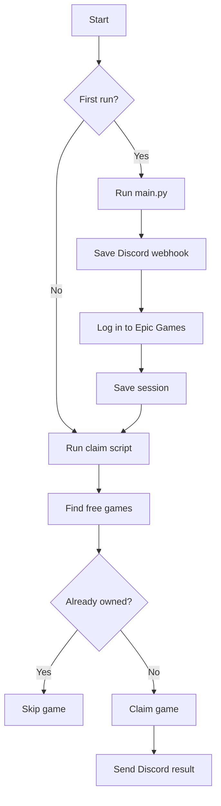

# Gamico Claim

Gamico Claim checks the Epic Games Store for free games and adds them to your Epic Games library. It can also send claim results to Discord.

You log in once through a normal browser window. After setup, the claim script can run automatically.

> This project is independent and is not affiliated with Epic Games, Discord, or RAWG. Epic may change its website or require CAPTCHA and account verification.

## Flow



## What Happens During a Run

1. The program checks Epic Games for current promotions.
2. It ignores games that are not completely free.
3. It opens each free game using your saved Epic session.
4. It skips games already in your library.
5. It completes the free checkout and checks the library again.
6. It sends a success or error message to Discord.

If there are no free games, the program ends normally without claiming anything.

## Requirements

- Python 3.10 or newer.
- An Epic Games account.
- A Discord server with an incoming webhook.
- Internet access to Epic Games and Discord.
- Linux only: `xvfb-run` for invisible background runs.

## Install

Open a terminal in the project folder and create or activate a virtual environment using your normal Python workflow. Then install the project packages:

```bash
python -m pip install --upgrade pip
python -m pip install -r requirements.txt
patchright install chromium
```

On Linux, install `xvfb-run` with your distribution's Xvfb package. For example, on Debian or Ubuntu:

```bash
sudo apt install xvfb
```

On Windows, use PowerShell from the project folder. After your virtual environment is active:

```powershell
python -m pip install --upgrade pip
python -m pip install -r requirements.txt
patchright install chromium
```

## First-Time Setup

Start the setup window:

Linux:

```bash
.venv/bin/python main.py
```

Windows PowerShell:

```powershell
.\.venv\Scripts\python.exe main.py
```

Then:

1. Click **Discord** and enter your Discord webhook URL.
2. Click the logo to open the Epic Games login window.
3. Log in manually.
4. Return to the terminal and press **Enter** when asked.
5. Close the browser and setup window.

The setup creates:

- `Config/discord.json` for the Discord webhook.
- `Config/session.json` for the Epic login session.

The files are created locally and are not uploaded by this project. The login session is used only by the claiming browser.

## Run

### Linux

Use this command for normal, scheduled, or background runs:

```bash
./run.sh
```

It uses `xvfb-run`, so Chromium runs on a temporary virtual display and no browser window is shown.

The Linux launcher is suitable for cron jobs and servers. The computer does not need a monitor or logged-in graphical desktop.

### Windows

```powershell
.\run_windows.bat
```

Windows does not use Xvfb. Keep Windows signed in while the script runs because Chromium needs a desktop session.

The Windows launcher may open a browser window while it works. Do not close that window during a claim.

## Scheduling

### Linux cron

Open your cron table:

```bash
crontab -e
```

Executes only on Wednesdays at 15:10 UTC (one day before the weekly reset). 
Replace the example path with your project path:

```cron
10 15 * * 3 /home/your-user/Gamico-Claim/run.sh >> /home/your-user/Gamico-Claim/claim.log 2>&1
```

### Windows Task Scheduler

1. Open **Task Scheduler** and choose **Create Task**.
2. Create a trigger for the time you want.
3. Add an action to start `run_windows.bat`.
4. Set **Start in** to the project folder.
5. Select **Run only when user is logged on**.
6. Test the task with **Run**.

Choose **Run only when user is logged on**. This is required because the Epic browser needs access to the Windows desktop.

## Optional RAWG Images

Successful Discord messages can include game images and extra information from RAWG. Set `RAWG_API_KEY` before running the claim script:

Linux:

```bash
export RAWG_API_KEY="your-api-key"
```

Windows PowerShell:

```powershell
$env:RAWG_API_KEY = "your-api-key"
```

The claim workflow does not require RAWG.

RAWG is used only to add optional game images and extra information to successful Discord messages. The claim can still work when no RAWG key is configured.

## Safety

Never share or commit these files:

- `Config/discord.json` contains your Discord webhook.
- `Config/session.json` contains your Epic login session.

If your Epic session expires, run `main.py` and log in again.

The promotion lookup currently uses the US store and English language settings.

## Troubleshooting

### A CAPTCHA or checkout error appears

Complete any required verification manually and try again later. Do not attempt to bypass CAPTCHA protection.

## License

No license file is included yet. Add a license before distributing the project.
